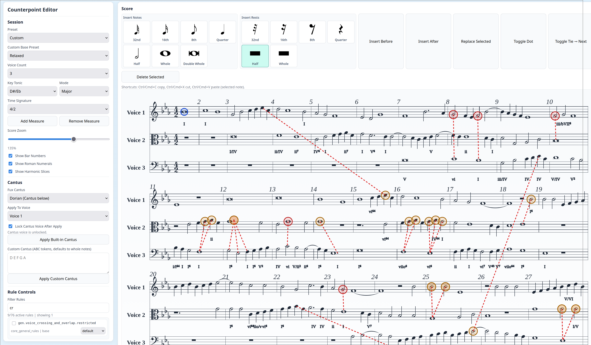

# Open Harmony

Open-source harmonic analysis and voice-leading toolchain focused on species counterpoint pedagogy.

Inspired by ArtInfuser / AIHarmony research and demos in this repository (`docs/demos/AiHarmony/`), this project builds a transparent, extensible analysis engine and editor workflow.

Harmonic ML analysis support in this project is based on AugmentedNet by Néstor Nápoles López:
https://github.com/napulen/AugmentedNet

## Note

All code in this repository is AI-generated.

## Licensing

1. First-party code is MIT licensed: see `LICENSE`.
2. Third-party components and submodules have separate licenses: see `THIRD_PARTY_NOTICES.md`.

## Purpose

Open Harmony provides:

1. A modular Rust analysis engine for harmony, counterpoint, and voice-leading diagnostics.
2. A web-based educational editor for species counterpoint.
3. A planned RealmGUI integration for DAW workflows (coming soon; see `docs/planning/project.md`).

## Components

1. Generic Rust engine:
`crates/cp_core`, `crates/cp_rules`, `crates/cp_engine`, `crates/cp_harmony`, `crates/cp_wasm`
2. Web species counterpoint editor:
`web/editor`
3. RealmGUI integration (planned):
See `docs/planning/project.md`

## Web UI Reference

Reference screenshot (Image #1):



## Web Client Setup

These instructions are for running `web/editor` from a clean clone.

### 1) Base prerequisites

1. Rust toolchain (`cargo`, `rustc`)
2. `wasm-pack`
3. Python 3 (for static file serving)
4. Node.js (only needed for web tests)

Install `wasm-pack` if needed:

```bash
cargo install wasm-pack
```

### 2) Build Rust/WASM analyzer (required for all web modes)

From repo root:

```bash
wasm-pack build crates/cp_wasm --target web --out-dir pkg
```

Required generated files:

1. `crates/cp_wasm/pkg/cp_wasm.js`
2. `crates/cp_wasm/pkg/cp_wasm_bg.wasm`

### 3) Start the web client

Serve the repository root (important: root, not `web/editor`):

```bash
python3 -m http.server 8000
```

Open:

```text
http://localhost:8000/web/editor/
```

At this point, `rule_based` analysis should work.

### 4) Enable `augnet_onnx` backend (optional, requires model artifacts)

The web client expects these runtime artifacts at fixed paths:

1. `models/augnet/AugmentedNet.onnx`
2. `models/augnet/model-manifest.json`

`model-manifest.json` is tracked in git. `AugmentedNet.onnx` is not tracked and must be generated locally.

If `uv` is not installed yet:

```bash
python3 -m pip install --user uv
```

Recommended artifact workflow:

1. Fetch source HDF5 model:

```bash
tools/augnet/fetch_model.sh models/augnet/source/AugmentedNet.hdf5
```

2. Convert HDF5 -> ONNX + regenerate manifest:

```bash
uv run --python 3.10 --with-requirements tools/augnet/requirements-conversion.txt \
  python tools/augnet/convert_to_onnx.py \
  --input-h5 models/augnet/source/AugmentedNet.hdf5 \
  --output-onnx models/augnet/AugmentedNet.onnx \
  --manifest models/augnet/model-manifest.json \
  --model-id augmentednet-v1 \
  --opset 13 \
  --overwrite
```

3. Verify files exist:

```bash
ls -lh models/augnet/AugmentedNet.onnx models/augnet/model-manifest.json
```

If you already have a trusted `AugmentedNet.onnx`, place it at `models/augnet/AugmentedNet.onnx` and keep `models/augnet/model-manifest.json` in sync with that artifact.

Notes:

1. The web AugmentedNet path loads `onnxruntime-web` from CDN (`jsdelivr`), so network access is required.
2. If ONNX or manifest is missing, selecting `augnet_onnx` will fail fast (fatal error, no JS fallback).

## Build And Test (Rust)

From repo root:

```bash
cargo test
cargo build --release
```

## How To Use The Web GUI

1. Build WASM (command above), then start the static server and open `http://localhost:8000/web/editor/`.
2. In **Session**, choose a preset (`species1`..`species5`, `general_voice_leading`, or `custom`), voice count, key/mode, and supported time signature.
3. Enter or edit notes in the voice text boxes (ABC-like tokens), or drag notes directly in the rendered score.
4. Optionally apply a built-in Fux cantus (or custom cantus), and lock its voice for exercises.
5. Use **Rule Controls** to enable/disable rules, filter rules, and set severity overrides.
6. Review diagnostics and score overlays; click diagnostics to highlight corresponding markings in the score.
7. Use MusicXML import/export and custom profile save/load as needed.

Engine status check:
- `Analyzer: Rust/WASM active` means the Rust analyzer is loaded.
- `Fatal initialization error: ...` means WASM failed to load and analysis is unavailable until fixed.

## Web Tests

```bash
cd web/editor
npm test
```

## Rebuild Loop After Code Changes

1. `cargo test` (optional but recommended)
2. `wasm-pack build crates/cp_wasm --target web --out-dir pkg`
3. Refresh browser tab (hard refresh if needed)
